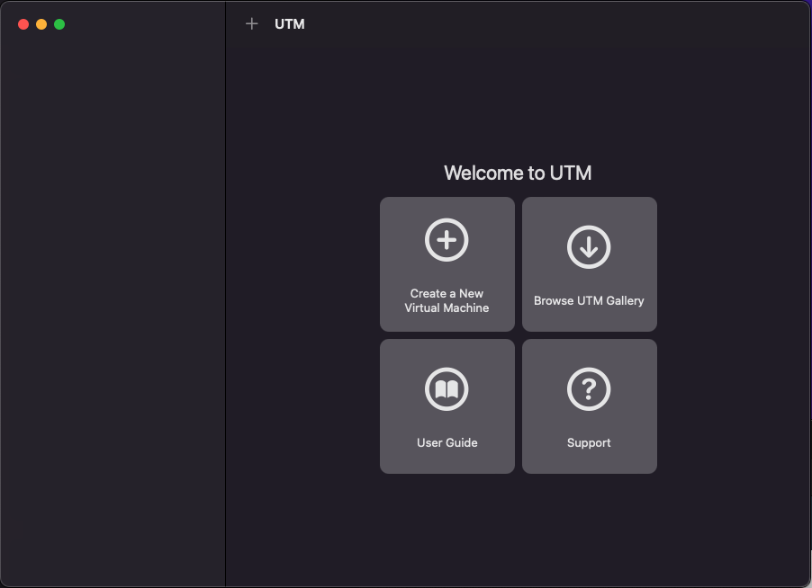
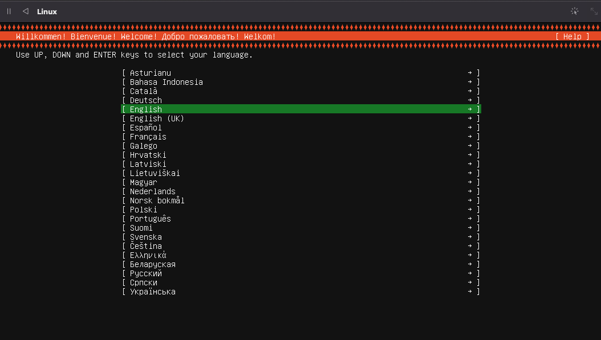

# Linux Virtual Machine on M1 MAC

1. Install UTM from:
`https://mac.getutm.app/`

2. Open UTM from your Application directory and press `Browse UTM Gallery`\

3. Select an OS. (Example: Ubuntu 20.04)\

4. Click the `Ubuntu Server for ARM` Link and download the ISO.\
5. In the UTM app, Press `Create a New Virtual Machine`\

6. Select `Virtualize`.\

7. Select `Linux`.\

8. Click `Browse` and select the Ubuntu Server ISO you just downloaded. 
Press `Continue`.\

9. Pick the amount of RAM and CPU cores you wish to give access to the VM. 
Press `Continue`.\

10. Specify the maximum amount of drive space to allocate. Press 
`Continue`.\

11. Select a directory to share files. (Example: `~/vm/ubuntu`). 
Alternatively, you can skip this and select the directory later from the 
VM window’s toolbar. The shared directory will be available after 
installing SPICE (see below) tools. Press `Continue`.\

12. Press `Save` to create the VM.\

13. press the Run button to start the VM.\

14. Go through the Ubuntu Server installer. If the reboot fails, you can 
manually quit the VM, unmount the installer ISO, and start the VM again to 
boot into your new installation.\



## Installing Ubuntu Desktop
#### At the end of the installation, you will have Ubuntu Server installed 
without any GUI. To install Ubuntu Desktop, log in and run:
```bash
$ sudo apt update
$ sudo apt install ubuntu-desktop
$ sudo reboot
```
## Enable clipboard and directory sharing
#### Install the following:
```bash
$ sudo apt install spice-vdagent spice-webdavd
```
##### Your shared directory shows up as a WebDAV server on 
http://127.0.0.1:9843/. You can use a WebDAV client to access it, or 
mount.davfs to mount it.
